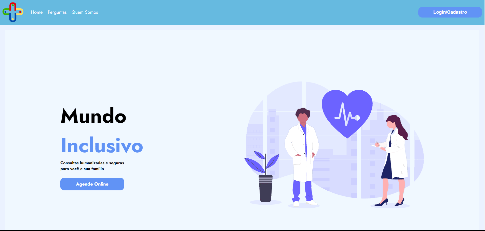

<h1 align="center"> Mundo Inclusivo </h1>

    Apoio para os pais atípicos  

  <a href="#-tecnologias">Tecnologias</a>&nbsp;&nbsp;&nbsp;|&nbsp;&nbsp;&nbsp;
  <a href="#-projeto">Projeto</a>&nbsp;&nbsp;&nbsp;|&nbsp;&nbsp;&nbsp;
  <a href="#-layout">Layout</a>&nbsp;&nbsp;&nbsp;|&nbsp;&nbsp;&nbsp;
  <a href="#memo-licença">Licença</a>

  

  

## 🚀 Tecnologias

Esse projeto foi desenvolvido com as seguintes tecnologias:

- React.js
- HTML e CSS
- JavaScript
- Git e Github
- Figma

## 🔖 Layout

Você pode visualizar o layout do projeto através [DESSE LINK](https://www.figma.com/design/bBSOOuLjufadvlLlMYx8d8/Projeto-Final-2?node-id=0-1&t=8x3mYwRrLQBJNyGK-0). É necessário ter conta no [Figma](https://figma.com) para acessá-lo.

## 💻 Projeto

O projeto Mundo Inclusivo oferece suporte dedicado a pais de crianças atípicas, especialmente focado em ajudar aqueles que acabaram de descobrir que seus filhos são autistas. Entendemos que essa jornada pode ser desafiadora e estamos aqui para fornecer orientações práticas, recursos úteis e suporte emocional. Além de informações valiosas sobre como lidar com o diagnóstico de autismo, nosso projeto também inclui uma comunidade de pais, onde é possível compartilhar experiências, trocar dicas e encontrar conforto em saber que não estão sozinhos. Embora ainda estejamos em fase de construção, nosso compromisso é criar um espaço acolhedor e informativo para todos os pais que precisam de apoio.